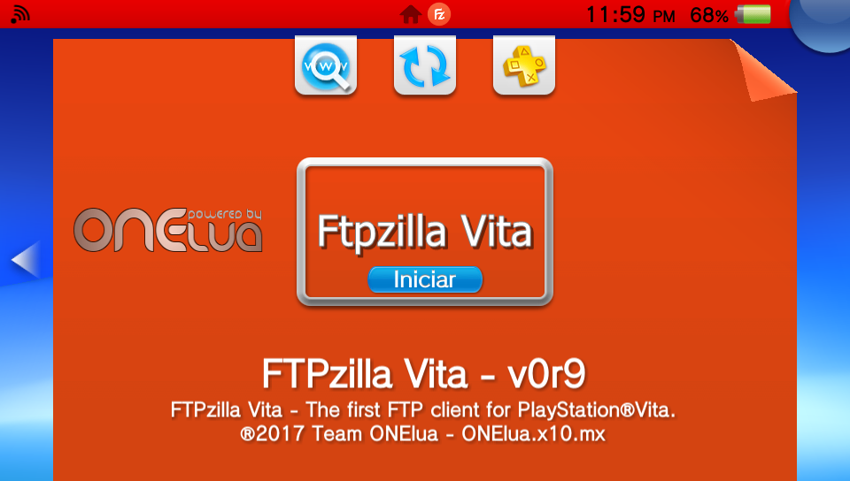
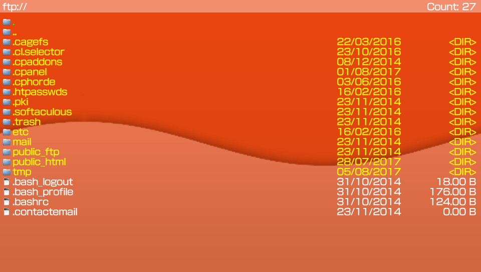

# FTPzillaVita  

The first FTP client for Play Station Vita...

### Description ###
This useful application will allow you to connect to ftp servers, and manage your files.

### Controls ###
- [up]/[down]: Browse the list of files.
- [cross]: Folder/Enter in directory selected - File/Download file selected to the root of the app.

### Changelog 0.9 ###
- Initial release.
- Added automatic network update. app will now notify you when there's a new update.
- Added config menu with some options.
- Support many unix servers.
- Support connection with pass.
- Support navigate between server files.
- Support download files.

### TO-DO ###
- Add support to tls/ssl.
- Add support to libftpvita (no send the match in list).
- Add more support to variety of servers.
- Add more GUI.
- Add more stuff.

### Report bugs ###
if you see something wrong, please submit an issue or pull request.

### Credits ###
- The idea comes from my friend and coder, **Nekerafa**.
- Icon By **TinyLab** in [Deviantart](http://tinylab.deviantart.com/art/Filezilla-Icon-510586622).

### Donation ###
In case you want to support my work on the vita, you can always donate for some coffee. Any amount is highly appreciated:

